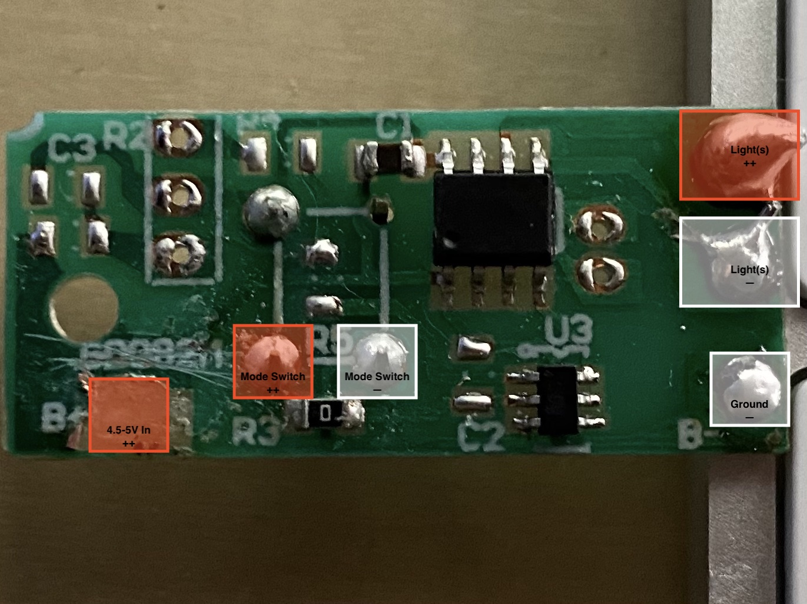
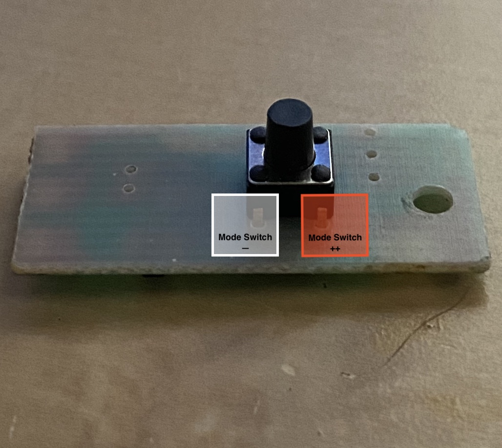
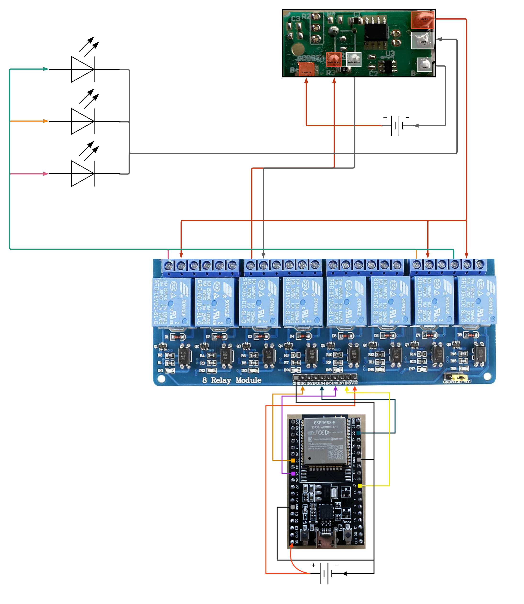

# HomeKit [these lights](https://www.target.com/p/led-curtain-string-light-west-arrow/-/A-81078103) from Target using an ESP32 and some soldering skills.

## Forewarning
These PCBs are extremely fragile. I destroyed the positive battery pad on one board and a transistor on another. I am also not an electrical engineer.

## Reference Board



## Requirements
### [ESP32](https://www.amazon.com/gp/product/B08HMJ1X6W/ref=ppx_yo_dt_b_asin_title_o02_s02?ie=UTF8&psc=1)
### [5V 8 Channel Mech Relay Switch](https://www.amazon.com/gp/product/B00DR9SE4A/ref=ppx_yo_dt_b_asin_title_o04_s00?ie=UTF8&psc=1)
### [Bridge example from my fork of esp-homekit-sdk](https://github.com/whymidnight/esp-homekit-sdk/tree/master/examples/bridge)
### Soldering Equipment
### 22 AWG Wire
### Breadboard or something to tie >1 wires into one.

## Wiring
* I power the lights through 2 battery packs in parallel connected to the B+ and B- pads on the control board.
* I have 3 lights that share positive and ground through the control board. 
* ESP32 and 5V Relay share positive and ground through a 5V 1.5A PSU.

## Schematic


## Deployment Pattern
### Warning
Do not flash your ESP32 with 5V input alongside the USB connection; [this may fry your board](https://techexplorations.com/guides/esp32/begin/power/).

### Getting Started
Follow these [steps](https://docs.espressif.com/projects/esp-idf/en/latest/esp32/get-started/index.html) to setup esp-idf. When done, source the _exports.sh_ file to use _idf.py_. Something like this,

```bash
. $HOME/esp/esp-idf/export.sh
```

### Setup
Clone my fork and cd into the bridge example.

```bash
git clone --recursive https://github.com/whymidnight/esp-homekit-sdk.git ./homekitwarez
cd ./homekitwarez/examples/bridge
```

You will need to generate the build files for the example -

```bash
idf.py set-target esp32
```

To flash your ESP32 -

```bash
export ESPPORT=$(ls -a /dev/cu.usbserial-* | head -1)  
idf.py flash monitor
```

To setup the Home App, scan the QR Code presented through the console terminal and name the lights and switches if you would like.

To reset your ESP32 - in case, something doesn't work.

```bash
esptool.py --chip esp32 --port $(ls -a /dev/cu.usbserial-* | head -1) erase_flash
```

## Demo
[](http://www.youtube.com/watch?v=1sRkk7BffAk "West and Arrow Curtain Light LED HomeKit Hack")

_Click on image above to view._
